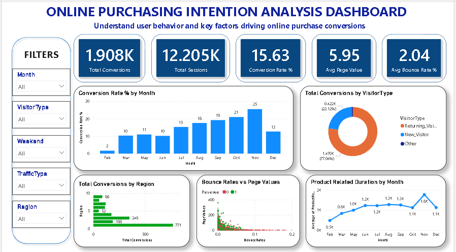

# online-shoppers-purchasing-intention-analysis
E-commerce customer behavior analysis using Python, SQL, and Power BI
# Online Shoppers Purchasing Intention Analysis

## Project Overview
This project analyzes online shopper behavior to identify the factors influencing purchase conversions in an e-commerce environment.

The analysis combines:
- Python for EDA & data cleaning
- SQL for business queries
- Power BI for dashboard visualization

Dataset contains:
- 12,330 user sessions
- 18 behavioral features
- Conversion outcomes (Revenue)

---

# Business Problem
E-commerce businesses often struggle to understand:
- Why users leave without purchasing
- Which visitor segments convert better
- Which months and traffic sources drive revenue

This project uncovers behavioral patterns that influence online purchasing decisions.

---

# Tools & Technologies

- Python
  - Pandas
  - NumPy
  - Matplotlib
  - Seaborn

- SQL (MySQL)

- Power BI

---

# Project Workflow

1. Data Cleaning
2. Exploratory Data Analysis
3. SQL Business Queries
4. Dashboard Development
5. Business Insights & Recommendations

---

# Key Insights

- November and October showed highest conversion rates.
- Returning visitors generated most conversions.
- New visitors showed higher page value per session.
- Lower bounce rates strongly correlated with conversions.
- Traffic Types 16, 7, and 8 performed best.
- Higher session duration increased conversion probability.

---

# Dashboard Preview



---

# SQL Analysis

Performed 18 business-focused SQL queries including:
- Monthly conversion analysis
- Traffic source performance
- Visitor type comparison
- Bounce rate impact
- Regional conversion trends

---

# Power BI Dashboard Features

- KPI Cards
- Monthly Conversion Trends
- Visitor Type Analysis
- Regional Performance
- Bounce Rate vs Page Value Scatter Plot
- Product Related Duration Trend

---

# Business Recommendations

- Increase marketing campaigns during Q4.
- Improve landing page quality to reduce bounce rates.
- Personalize experiences for new visitors.
- Invest more in high-converting traffic sources.
- Optimize internal navigation to increase session duration.

---

# Repository Structure

```bash
├── data/
├── notebooks/
├── sql/
├── powerbi/
├── presentation/
├── images/
```

---

# Author

Komal Kakkar

Data Analyst skilled in Python, SQL, Excel, and Power BI.
